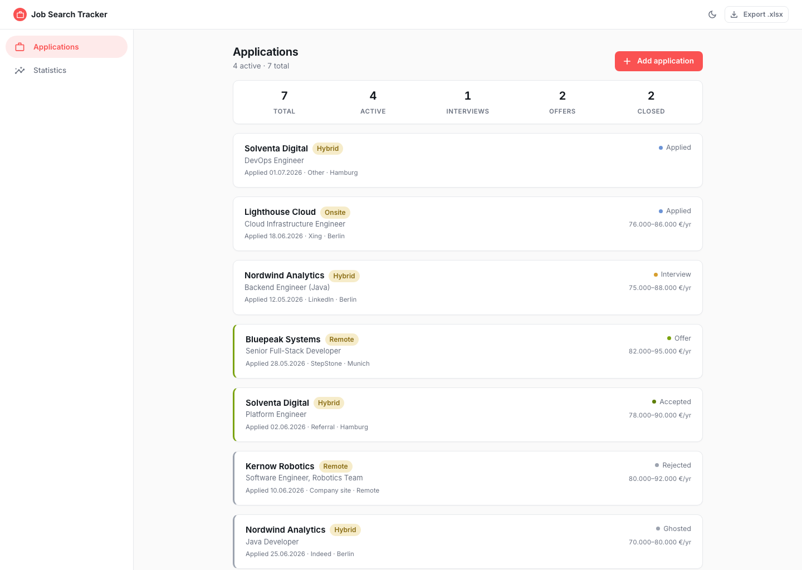
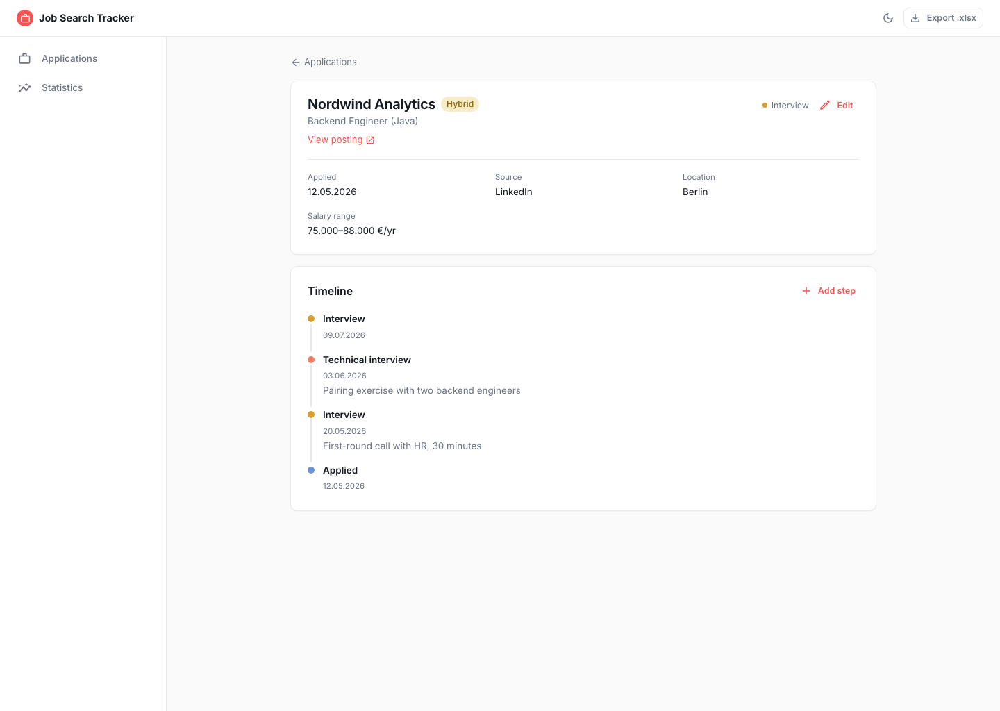
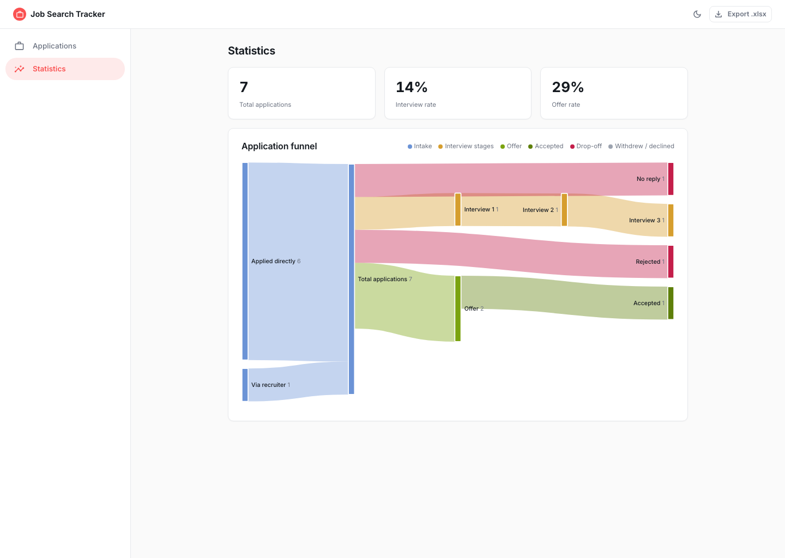

# Job Search Tracker

[](https://github.com/yogacat/job-search-tracker/actions/workflows/ci.yml)
[](https://github.com/yogacat/job-search-tracker/actions/workflows/codeql.yml)
[](LICENSE)

Track roles you're applying to — status, the steps at each company (screening, interview,
task, offer, rejection), and what's next — then export a one-row-per-application list for the
**Agentur für Arbeit** as proof of your Eigenbemühungen.

Single-user, self-hosted, same shape as the Zalando Pipeline app (Spring Boot backend +
React/MUI frontend). The backend is written separately.

<p>
  
  
  
</p>

(Sample data shown — not real applications.)

## Running the backend

The backend is a Spring Boot app (Java 26) backed by Postgres, with schema migrations via Flyway.
The frontend talks to it over `/api` and won't do much without it running — start this first.

Copy `.env.example` to `.env` and fill in real values, then start Postgres + backend together
with Docker Compose:

```bash
cp .env.example .env
docker compose up -d
```

This reads `.env` for `POSTGRES_USER` / `POSTGRES_PASSWORD` / `POSTGRES_DB`, and serves the API at
`http://localhost:8081`.

To run the backend locally from your IDE instead (against the same Dockerized Postgres):

```bash
docker compose up -d jobsearch-postgres   # Postgres only, published at localhost:5434
cd backend
./mvnw spring-boot:run
```

### Testing

```bash
cd backend
./mvnw test
```

Covers controllers (`@WebMvcTest`), services (plain Mockito unit tests), and repositories
(`@DataJpaTest` against an in-memory H2 database — schema is Hibernate-generated for the test
slice, not Flyway, since H2 can't run the Postgres-specific migration SQL verbatim).

## Frontend

React/MUI app that talks to the real backend via `/api` (the Vite dev server proxies it to
`http://localhost:8081` — see `frontend/vite.config.ts`). It reuses the Zalando app's design
system (teal accent, quiet status dots, 3px left accent bar, Inter + tabular numerals).

```bash
cd frontend
npm install
npm run dev        # http://localhost:5174
```

### What it does
- **Applications** — list with summary stats (total / active / interviews / offers / closed),
  a left accent bar that flags offers (green), due-soon next steps (orange) and overdue (red),
  and closed applications (gray). Add applications via the dialog.
- **Application detail** — all fields plus a dated **timeline** ("steps I had there"); add steps.
- **Statistics** — status funnel with interview-rate / offer-rate metrics.
- **Export .xlsx** (top-right) — downloads the Agentur-für-Arbeit sheet
  (`Datum | Firma | Position | Art der Bewerbung | Status/Ergebnis | Link`) as a real `.xlsx`,
  streamed by the backend via Apache POI.

## License

[Individual Noncommercial Use License](LICENSE) (adapted from PolyForm Noncommercial 1.0.0) —
free for an individual to run and modify for personal, noncommercial purposes. No company,
organization, or other legal entity may use it under any circumstance, and no commercial use
or resale.
